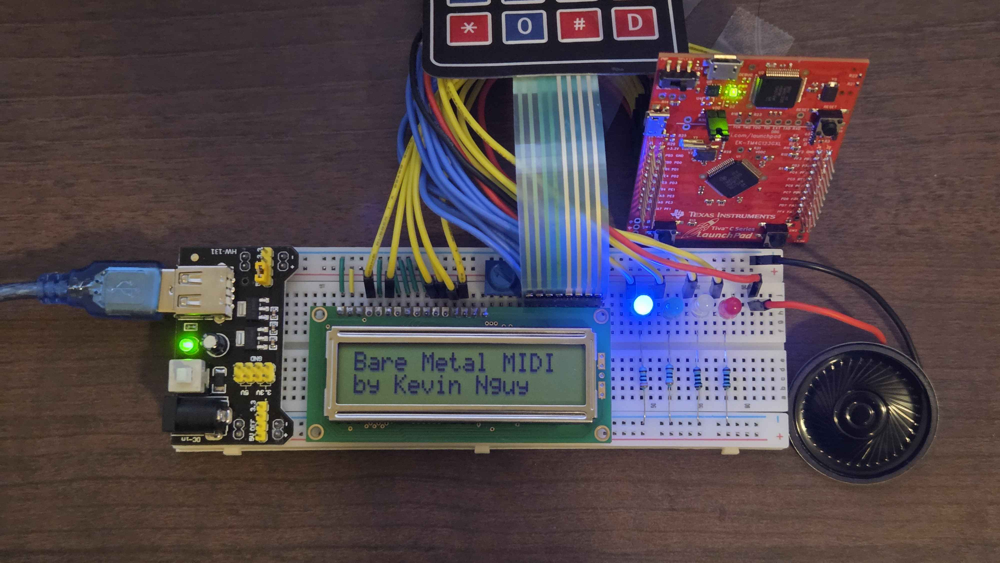
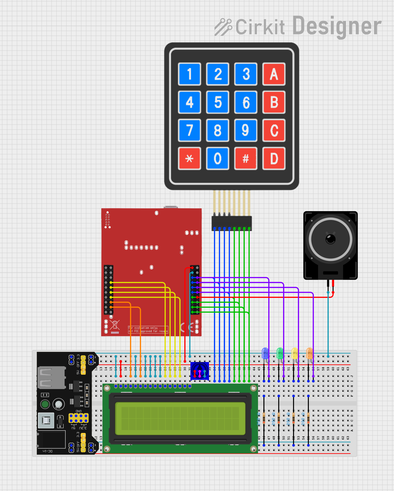
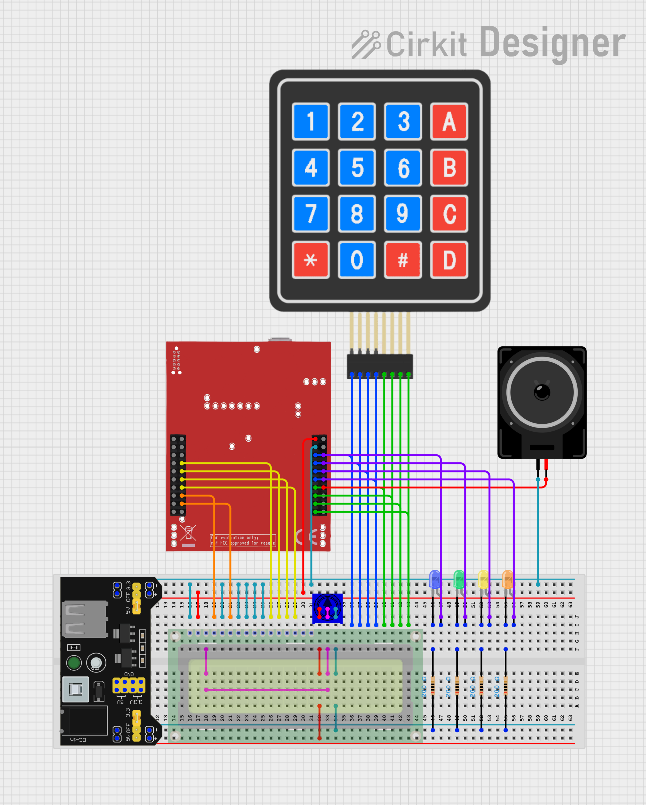

# Bare Metal MIDI Player on Tiva C Series Microcontroller

## Overview
This project implements a bare metal MIDI player on a Tiva C Series microcontroller without using any external libraries or an RTOS.

The player reads preloaded MIDI data from the microcontroller's flash memory, parses the MIDI events, and generates sound through a PWM-based audio output connected to a small speaker.

Song metadata such as title, artist, duration, and current playback time are displayed on an attached LCD.

## Features
- Supports playback of songs from standard MIDI files
- Up to 9 different songs preloaded in flash memory
- Up to 8 simultaneous notes (polyphony)
- 4 selectable waveforms: Sine, Triangle, Sawtooth, Square
- Scrolling text display of current song title and artist name on a connected LCD
- Real-time display of song duration and current playback time

## Hardware Setup
### Components
- Tiva C Series Microcontroller (TM4C123GH6PM)
- 8Ω 0.5W Speaker
- 16x2 Character LCD
- Potentiometer
- 4 x color LEDs for waveform indication
- 4 x Resistors for LEDs
- Breadboard Power Supply Module
- Breadboard and Jumper Wires

### Circuit Diagram

### Wiring
| Tiva Pin | Component | Description |
| :------- | :------- | :-------- |
| PC4-PC7     | LCD D4-D7  | LCD Data |
| PD6   | LCD RS    | LCD Register Select |
| PD7   | LCD E     | LCD Enable |
| PD0-PD3 | Keypad R1-R4 | Keypad Rows |
| PE1-PE3, PF1 | Keypad C1-C4 | Keypad Columns |
| PB4 | Speaker Output | PWM Audio Output |
| PB0-PB1, PE4-PE5 | LEDs | Waveform Indicators |

### Keypad Controls
The MIDI player is controlled using a 4x4 matrix keypad. The following table outlines the key functions:
| Key | Function |
| :-- | :------- |
| 1-9   | Select Song |
| * | Previous Song |
| 0 | Play/Pause |
| # | Next Song |
| A | Select Sine Waveform |
| B | Select Triangle Waveform |
| C | Select Sawtooth Waveform |
| D | Select Square Waveform |